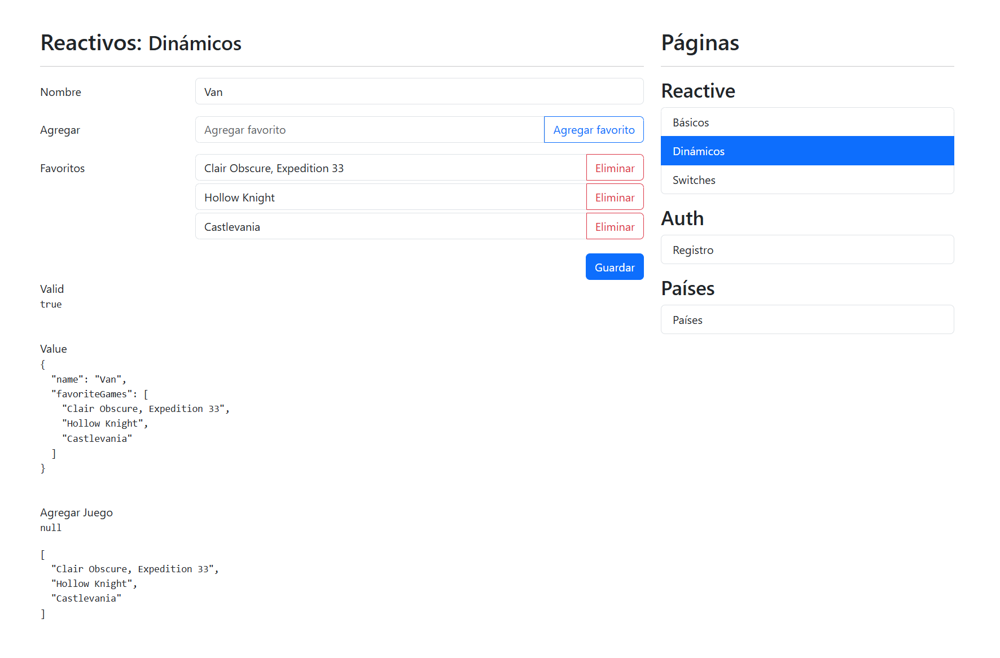

<div align="center">
  <br />
  <h1>📝 Reactive Forms App</h1>
  <h3 align="center">Devtalles course | 06 Reactive Forms App</h3>
    <a href="#" target="_blank">
      
    </a>
  <br />

  <div>
     
    
    
    
  </div>

   <div align="center">
     <h3>Reactive Forms lesson</h3>
    </div>
</div>

## 📝 <a name="table">Table of Contents</a>

1. 🤖 [**Introduction**](#introduction)
2. ⚙️ [**Tech Stack**](#tech-stack)
3. ⚡ [**Quick Start**](#quick-start)

## <a name="introduction">🤖 Introduction</a>

<strong>Learning purposes Angular</strong> Project. The app's idea is to learn and practice with Angular Reactive Forms.

Builded from Devtalles course where I learned the next lessons:


- **Date Pipe**
- **UpperCase Pipe**
- **LowerCase Pipe**
- **TitleCase Pipe**
- **Currecy Pipe**
- **Decimal Pipe**
- **Percent Pipe**
- **i18nPlural Pipe**
- **i18nSelect Pipe**
- **Json Pipe**
- **KeyValue Pipe**
- **Slice Pipe**
- **Async Pipe**
- **Pipes and Application Internationalization Settings**
- **String transform Pipes**
- **Pipes inside of Computed Properties**
- **Array filter Pipes**


## <a name="tech-stack">⚙️ Tech Stack</a>

- [**Angular 20**](https://angular.dev/)
- [**TypeScript**](https://www.typescriptlang.org/)
- [**TailwindCSS**](https://tailwindcss.com/)
- [**DaisyUI**](https://daisyui.com/docs/install/)


## <a name="quick-start">⚡ Quick Start</a>

### Prerequisites

Make sure you have the following installed on your machine:

- [**Git**](https://git-scm.com/)
- [**npm**](https://www.npmjs.com/) (Node Package Manager)
- [**Angular CLI**](https://angular.dev/)

### Cloning the Repository

```bash
git clone https://github.com/Ivanlopez-dev/reactive-forms-app.git
cd <your-project>
```

### Installation

Install the project dependencies using npm:

```bash
npm install
```

### Running the Project

```bash
ng serve -o
```

Open [**http://localhost:4200**](http://localhost:4200) in your browser to view the project.

